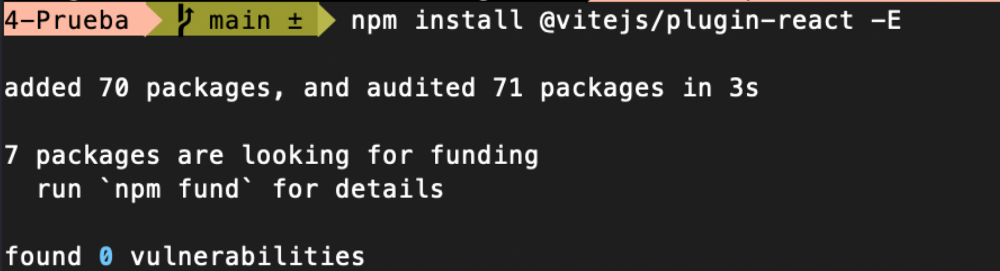
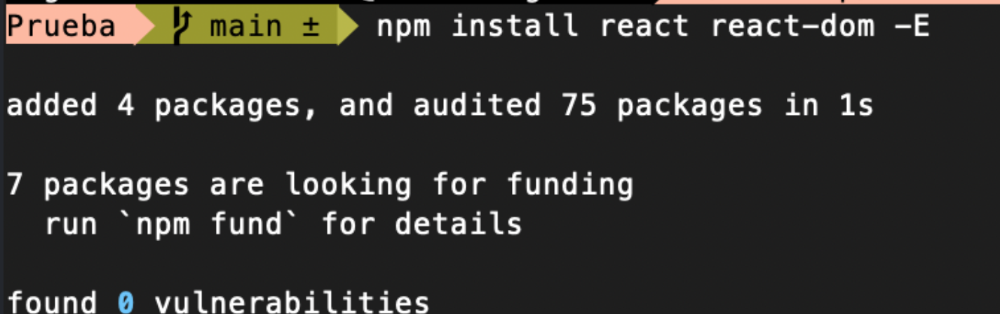
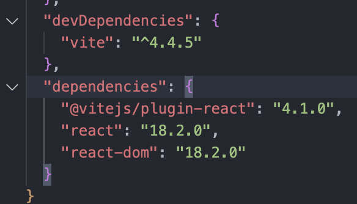
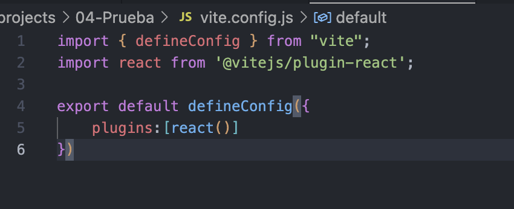
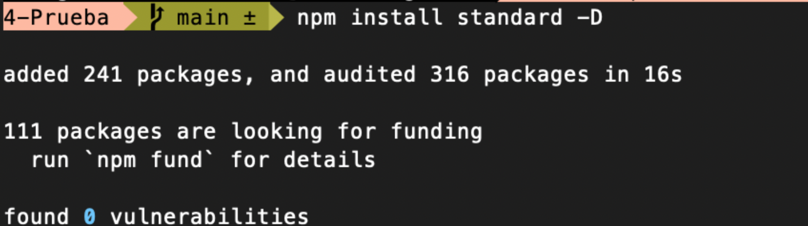
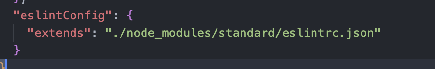

# Ejercicios Pruebas Tecnicas

## 1. Crear punto de entrada a React

1. Es necesaria la instalacion de vite con (npm install vite@latest) y posteriormente instalar el plugin de __React__ como se ve en la imagen a continuacion (primer comando). Luego de esto instalamos React (bibliotecas) y React dom (relacion con navegador). 

    1. Instalamos el plugin
    

    2. Instalamos React y React dom
    
2. Se nos crearan las siguientes dependencias.

3. Crear configuracion de Vite.

4. Instalar Linter para identificar errores y ayudarnos en el desarrollo.

    1. Instalamos por consola
    

    2. Creamos la dependencia
    
    

