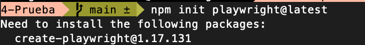
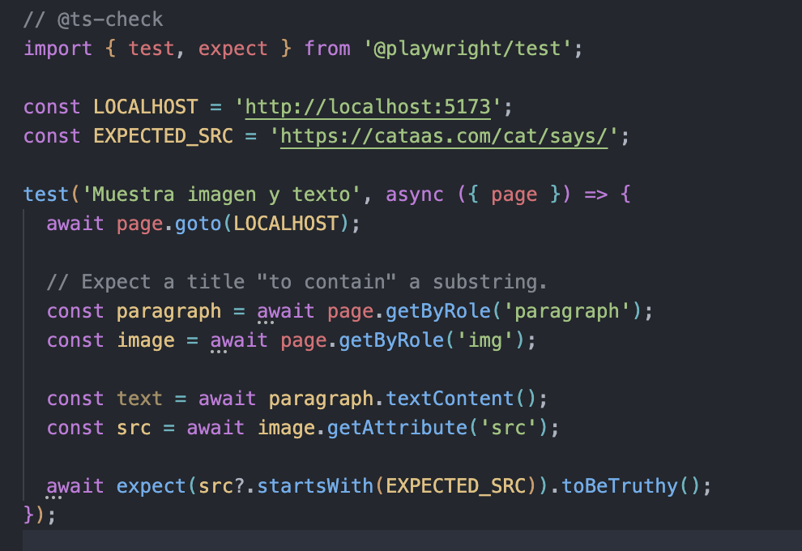
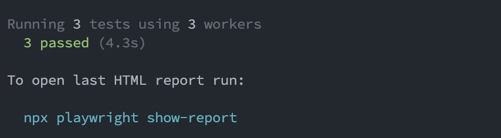
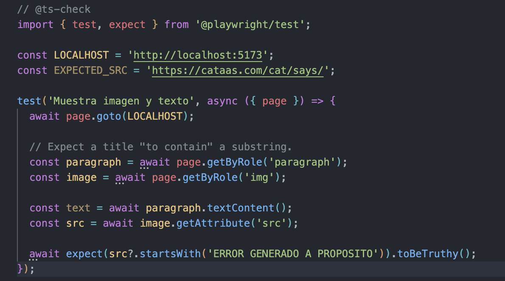
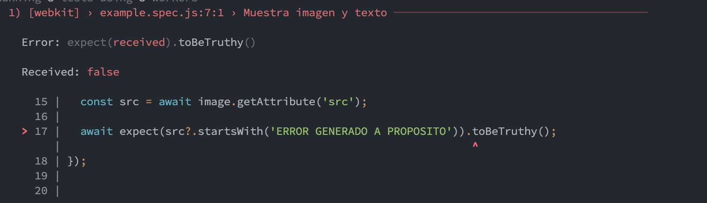
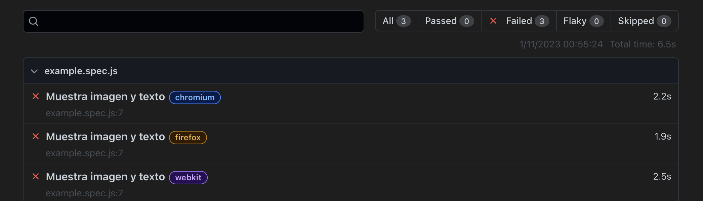

# Ejercicios Pruebas Tecnicas

## 1. Prueba tecnica para Juniors y Trainee

- Facts Random: https://catfact.ninia/fact
- Imagen random: https://cataas.com/cat/says/hello
    - `https://cataas.com/cat/says/${gato}?fontSize=50&fontColor=red&json=true`

- Recupera un hecho aleatorio de gatos de la primera API
- Recuperar la primera palabra del hecho
- Muestra una imagen de un gato con la primera palabra.

## 2. Crear punto de entrada a React

1. Es necesaria la instalacion de vite con (npm install vite@latest) y posteriormente instalar el plugin de __React__ como se ve en la imagen a continuacion (primer comando). Luego de esto instalamos React (bibliotecas) y React dom (relacion con navegador). 

    1. Instalamos el plugin
    

    2. Instalamos React y React dom
    
2. Se nos crearan las siguientes dependencias.

3. Crear configuracion de Vite.

4. Instalar Linter para identificar errores y ayudarnos en el desarrollo.

    1. Instalamos por consola
    

    2. Creamos la dependencia
    
    
## 3. Tests

1. Inicia el testing

2. Preparacion del Test

3. Resultado del Test (exitoso)

4. Preparacion de Test forzando fallo

5. Resultado del Test (fallo)

6. Resultados fallidos en navegador

